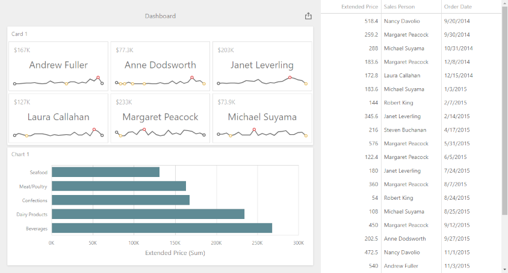

<!-- default badges list -->

<!-- default badges end -->

# Dashboard for Web Forms - How to obtain underlying data for the specified dashboard item

The example shows how to get underlying data for the specified dashboard item. Underlying data is displayed in the `dxDataGrid` widget placed next to the Web Dashboard.

The example uses the [ViewerApiExtension.requestUnderlyingData](https://docs.devexpress.com/Dashboard/js-DevExpress.Dashboard.ViewerApiExtension?p=netframework#js_devexpress_dashboard_viewerapiextension_requestunderlyingdata) method and passes the component name of the dashboard item and specific parameters to request data.

## Files to Look At

* [Default.aspx](./CS/ASPxDashboard_RequestUnderlyingData/Default.aspx) (VB: [Default.aspx](./VB/ASPxDashboard_RequestUnderlyingData/Default.aspx))
* [UnderlyingData.js](./CS/ASPxDashboard_RequestUnderlyingData/Scripts/UnderlyingData.js) (VB: [UnderlyingData.js](./VB/ASPxDashboard_RequestUnderlyingData/Scripts/UnderlyingData.js))

## Documentation

- [Obtain Underlying and Displayed Data in the ASP.NET Web Forms Dashboard Control](https://docs.devexpress.com/Dashboard/18078)

## More Examples

- [Dashboard for Web Forms - How to obtain a dashboard item's client data](https://github.com/DevExpress-Examples/asp-net-web-forms-dashboard-obtain-dashboard-item-client-data)
- [Dashboard for Web Forms - How to obtain a dashboard item's underlying data for a clicked visual element](https://github.com/DevExpress-Examples/asp-net-web-forms-dashboard-get-underlying-data-for-clicked-item)
- [Dashboard for ASP.NET Core - How to obtain a dashboard item's underlying data for a clicked visual element](https://github.com/DevExpress-Examples/asp-net-core-dashboard-get-underlying-data-for-clicked-item)
- [Dashboard for ASP.NET Core - How to obtain underlying data for the specified dashboard item](https://github.com/DevExpress-Examples/asp-net-core-dashboard-display-item-underlying-data)
- [Dashboard for MVC - How to obtain a dashboard item's client data](https://github.com/DevExpress-Examples/asp-net-mvc-dashboard-get-client-data)
- [Dashboard for MVC - How to obtain underlying data for the specified dashboard item](https://github.com/DevExpress-Examples/asp-net-mvc-dashboard-display-item-underlying-data)
- [Dashboard for MVC - How to obtain a dashboard item's underlying data for a clicked visual element](https://github.com/DevExpress-Examples/asp-net-mvc-dashboard-get-underlying-data-for-clicked-item)
